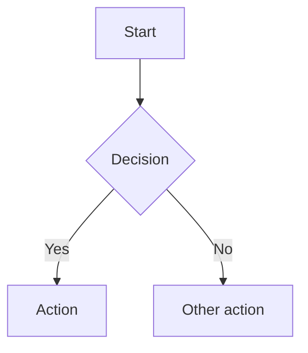

# content.markhuang.ai

Content repository for [markhuang.ai](https://markhuang.ai). On push to `main`, GitHub Actions compiles MDX articles with shiki syntax highlighting and uploads them to Cloudflare R2. The frontend fetches pre-highlighted content from R2 at ISR time — no backend content proxy, no runtime shiki.

## Structure

```
content.markhuang.ai/
├── blog/
│   ├── manifest.json          # Source of truth for all article metadata
│   ├── ai-llms/               # AI & LLMs category
│   ├── motorcycles/            # Motorcycles category
│   ├── software-engineering/   # Software Engineering category
│   └── tutorials/              # Tutorials category
│       └── *.mdx               # Article content files
├── knowledge/                  # AI chat widget knowledge base (*.md)
├── scripts/
│   ├── compile.ts             # Shiki pre-highlighting + dist/ output
│   └── convert-images.sh      # WebP image conversion
├── .github/workflows/
│   └── publish.yml            # CI: compile → R2 upload → ISR revalidate
└── dist/                      # Build output (gitignored)
    ├── manifest.json          # Flat array of published entries
    └── articles/{slug}.mdx    # Pre-highlighted MDX
```

## Blog Articles

### manifest.json

All article metadata lives in `blog/manifest.json`. Each entry contains:

| Field           | Type       | Description                              |
|-----------------|------------|------------------------------------------|
| `slug`          | string     | URL-safe identifier (matches MDX filename) |
| `title`         | string     | Article title                            |
| `description`   | string     | Short description for SEO/previews       |
| `date`          | string     | Publication date (`YYYY-MM-DD`)          |
| `category`      | string     | Directory name (e.g. `tutorials`)        |
| `categoryLabel` | string     | Display name (e.g. `Tutorials`)          |
| `tags`          | string[]   | Topic tags                               |
| `published`     | boolean    | Set `false` to hide from listings        |
| `image`         | string\|null | Optional hero image URL                |
| `readTime`      | string     | Estimated read time (e.g. `11 min read`) |

### MDX Files

Article content is stored as MDX at `blog/{category}/{slug}.mdx`.

## Knowledge Base

Markdown files in `knowledge/` are used by the AI chat widget. The backend fetches these via the GitHub raw API (unchanged by the R2 content pipeline).

## Content Pipeline

```
Push to main → CI compiles → Upload to R2 → ISR revalidation → Cloudflare cache purge
                  ↓                                ↓
           shiki highlighting              Backend notified of
           (dual themes)                   new articles for newsletter
```

| Step | What happens |
|------|-------------|
| **Compile** | `scripts/compile.ts` runs shiki on fenced code blocks (18 languages, dual themes: `github-light`/`github-dark`) |
| **Upload** | Compiled MDX + manifest uploaded to R2 via S3-compatible API |
| **Revalidate** | `POST /api/v1/hooks/revalidate` triggers Next.js ISR cache refresh |
| **Newsletter** | `POST /api/v1/hooks/content-published` creates newsletter drafts for new articles |

### Required GitHub Secrets

| Secret | Purpose |
|--------|---------|
| `CLOUDFLARE_ACCOUNT_ID` | Cloudflare account ID |
| `CLOUDFLARE_API_TOKEN` | API token (`Workers R2 Storage:Edit` + `Zone Cache Purge`) |
| `CLOUDFLARE_ZONE_ID` | Zone ID for CDN cache purge |
| `R2_BUCKET_NAME` | R2 bucket name |
| `HOOK_BEARER_TOKEN` | Bearer token for backend hook endpoints |
| `SITE_URL` | Production URL (e.g. `https://markhuang.ai`) |

## Local Development

```bash
bun install               # install dependencies
bun run compile           # compile all published articles to dist/
bun run compile:changed slug1 slug2  # compile specific articles only
```

## Adding a New Article

1. Add a new entry to `blog/manifest.json` with all required fields
2. Create the MDX file at `blog/{category}/{slug}.mdx`
3. Push to `main` — CI compiles, uploads to R2, and triggers ISR revalidation

## MDX Features

The following features are supported in `.mdx` article files.

### Syntax-Highlighted Code Blocks

Standard fenced code blocks with language identifiers are syntax-highlighted automatically. Supported languages include `go`, `typescript`, `javascript`, `python`, `bash`, `json`, `yaml`, and many others.

````mdx
```go
func main() {
    fmt.Println("Hello, world!")
}
```
````

### Playground Code Blocks

Add `playground` after the language identifier to include a "Run this code" link to the Go Playground.

````mdx
```go playground
package main

import "fmt"

func main() {
    fmt.Println("Try it on the Go Playground")
}
```
````

### Mermaid Diagrams

Use `mermaid` as the language identifier to render diagrams as inline SVG charts.

````mdx

````

### Callout Components

Use the `<Callout>` component with a `type` prop to render styled callout boxes.

```mdx
<Callout type="info">Informational note for the reader.</Callout>

<Callout type="warning">Warning about a potential issue.</Callout>

<Callout type="tip">Helpful tip or best practice.</Callout>

<Callout type="error">Error or critical notice.</Callout>
```

Supported types: `info`, `warning`, `tip`, `error`.

### Images

Standard markdown image syntax is rendered as a Next.js `<Image>` component wrapped in `<figure>` / `<figcaption>` for accessibility and layout.

```mdx

```

### Tables

GFM (GitHub Flavored Markdown) tables are supported and rendered inside a responsive wrapper for horizontal scrolling on small screens.

```mdx
| Column A | Column B | Column C |
|----------|----------|----------|
| value 1  | value 2  | value 3  |
```
